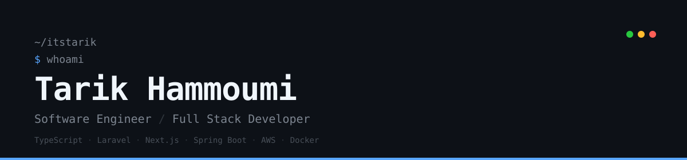

<div align="center">



[](https://git.io/typing-svg)

</div>

---

### About Me

```yaml
name: Tarik Hammoumi
role: Software Engineer | Full Stack Developer
location: Ghazaouet, Algeria
education: MSc in Software Engineering
contact: contact@itstarik.com
website: https://itstarik.com
```

---

### Tech Stack

**Languages**


**Frontend**


**Backend**


**Databases**


**Testing**


**DevOps & Cloud**


---

### GitHub Stats

<div align="center">


</div>

---

### Connect with Me

<div align="center">

[](https://itstarik.com)
[](mailto:contact@itstarik.com)
[](https://www.linkedin.com/in/itstarik/)
[](https://github.com/ItsTarikBTW)

</div>

<div align="center">


</div>
